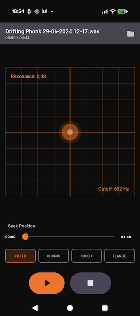

# KaossEffect

**KaossEffect** is a high-performance Android audio application that enables real-time effects processing on MP3 tracks. Inspired by the Korg Kaoss Pad, it features an intuitive **XY Pad interface** that allows users to manipulate two effect parameters simultaneously using touch gestures.

## Screenshots
*Main interface with XY pad and effect controls*

## Features

### 🎛 Real-time Audio Effects
The app includes four custom DSP effects, implemented in high-performance C++ using the **Oboe** audio library:

*   **Filter (Low-Pass)**: Controls Cutoff Frequency (X-axis) and Resonance (Y-axis).
*   **Chorus**: Adds richness and width with Mod Rate (X-axis) and Depth (Y-axis).
*   **Bitcrusher**: Creates lo-fi digital distortion by reducing Bit Depth (X-axis) and Sample Rate (Y-axis).
*   **Flanger**: Produces a sweeping jet-plane sound via LFO Rate (X-axis) and Depth (Y-axis).

### 🎚 Interface & Controls
*   **XY Pad**: Smooth, responsive touch surface for dynamic sound manipulation.
*   **Effect Toggling**: Tap an effect to enable it. Tap the active effect again to bypass all effects.
*   **Transport Controls**: Play, Pause, Stop, and a precision Seekbar with time display (mm:ss).
*   **Audio Focus**: Automatically pauses playback when interrupted (e.g., by a phone call).
*   **Soft Clipper**: Integrated tube-like soft clipper on the master output to prevent digital distortion.

## Technical Stack

*   **Language**: Kotlin (UI) + C++17 (Audio Engine)
*   **UI Framework**: Jetpack Compose (Material3)
*   **Audio Engine**: Google Oboe (Low-latency audio streams)
*   **Decoding**: Android NDK MediaCodex + MediaExtractor (Native MP3 decoding)
*   **Architecture**: MVVM with unidirectional data flow

## Getting Started

### Prerequisites
*   Android Studio
*   Android Device or Emulator (API 26+)

### Building and Running
1.  Clone the repository.
2.  Open the project in Android Studio.
3.  Sync Gradle project.
4.  Run on a connected device or emulator (`Shift + F10`).
5.  *Note: The native C++ library (`native-lib`) will automatically build via CMake.*

## Usage
1.  **Load a Track**: Tap the folder icon in the top-right corner to open the system file picker and select an MP3 file.
2.  **Play**: Tap the Play button at the bottom.
3.  **Apply Effects**:
    *   Select an effect from the mode selector (Filter, Chorus, Crush, Flange).
    *   Drag your finger on the central pad to change parameters in real-time.
    *   Tap the currently active effect button to turn it **OFF** (Bypass).
4.  **Seek**: Drag the slider to jump to a specific part of the track.

## License
MIT
